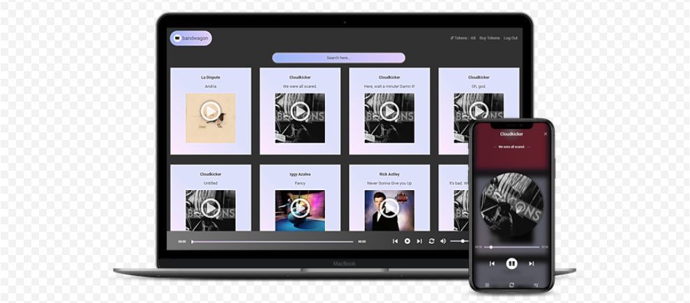
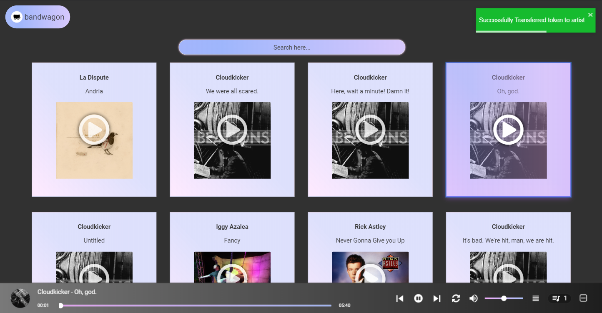
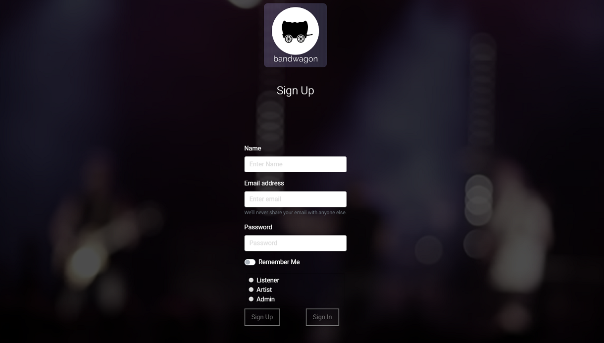
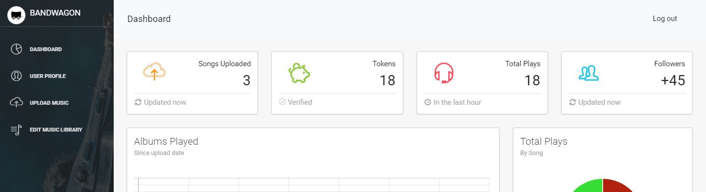
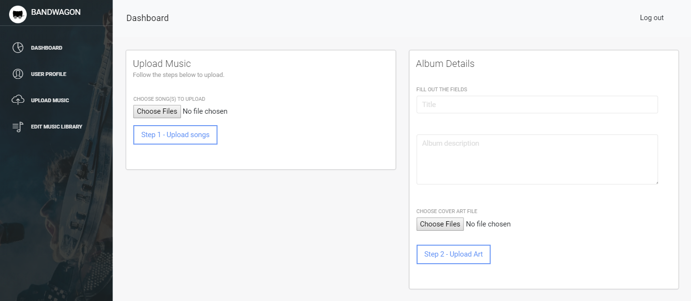

# Bandwagon

## Link

[Bandwagon - Live App](https://bandwagon-project.herokuapp.com/)

## User Story
As a consumer who enjoys streaming music, I want an application that allows me to listen to music while directly supporting the artists I enjoy so that I can get my music fix while funding artists instead of corporations.

As an artist/musician/band, I want a service that allows me to not only cut out the distribution middlemen that eat away at my profit (CDBaby, Tunecore, etc), but also allows my fans to directly support what I create, so that I can continue doing what I love and make money in the process.

## Description
A digital music streaming platform designed with listeners and artists in mind.

## Technologies Utilized
React.js, MongoDB, Atlas, Mongoose AWS S3, Express, Stitch, Stripe, Node.js

## Screen Shots

### Development Team

- [Alex Gignilliat](https://github.com/alexgignilliat)
- [Alan Grosse](https://github.com/aagrosse)
- [Daria Naumova](https://github.com/DariaNau)
- [Mesay Bekele](https://github.com/mesayb)

## Contributing
Pull requests are welcome. For major changes, please open an issue first to discuss what you would like to change.
Please make sure to update tests as appropriate.

## License
[MIT]
MIT License

Permission is hereby granted, free of charge, to any person obtaining a copy
of this software and associated documentation files (the "Software"), to deal
in the Software without restriction, including without limitation the rights
to use, copy, modify, merge, publish, distribute, sublicense, and/or sell
copies of the Software, and to permit persons to whom the Software is
furnished to do so, subject to the following conditions:

The above copyright notice and this permission notice shall be included in all
copies or substantial portions of the Software.

THE SOFTWARE IS PROVIDED "AS IS", WITHOUT WARRANTY OF ANY KIND, EXPRESS OR
IMPLIED, INCLUDING BUT NOT LIMITED TO THE WARRANTIES OF MERCHANTABILITY,
FITNESS FOR A PARTICULAR PURPOSE AND NONINFRINGEMENT. IN NO EVENT SHALL THE
AUTHORS OR COPYRIGHT HOLDERS BE LIABLE FOR ANY CLAIM, DAMAGES OR OTHER
LIABILITY, WHETHER IN AN ACTION OF CONTRACT, TORT OR OTHERWISE, ARISING FROM,
OUT OF OR IN CONNECTION WITH THE SOFTWARE OR THE USE OR OTHER DEALINGS IN THE
SOFTWARE.

- - - - -

